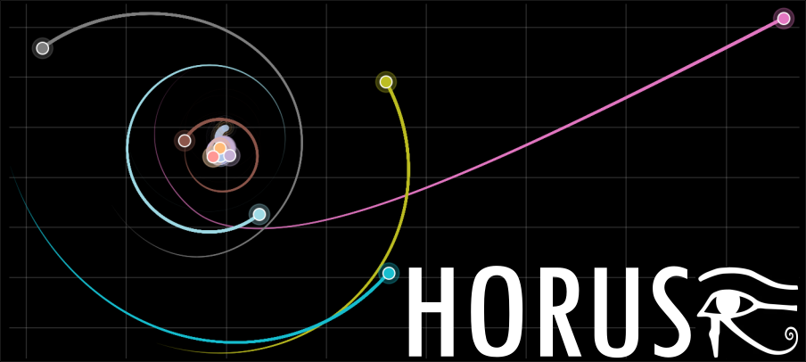

# HORUS
Heliocentric Orbital Resolver for Unstable Systems

  

HORUS is a toolbox for running numerical simulations of N‑body gravitational systems.
It uses the Discrete Element Method (DEM) and provides three solver implementations (Iterative object-by-object, NumPy vectorized, Numba-parallelized)
Each solver supports three numerical integration methods (Symplectic Euler, Verlet leapfrog, Runge–Kutta 4th order)

In addition to the core source code, HORUS includes an orbital visualizer and several example simulations.

HORUS was designed with a focus on efficient and precise scientific computation, built with passion and without pretension.

I hope you enjoy using it.

— Alex
